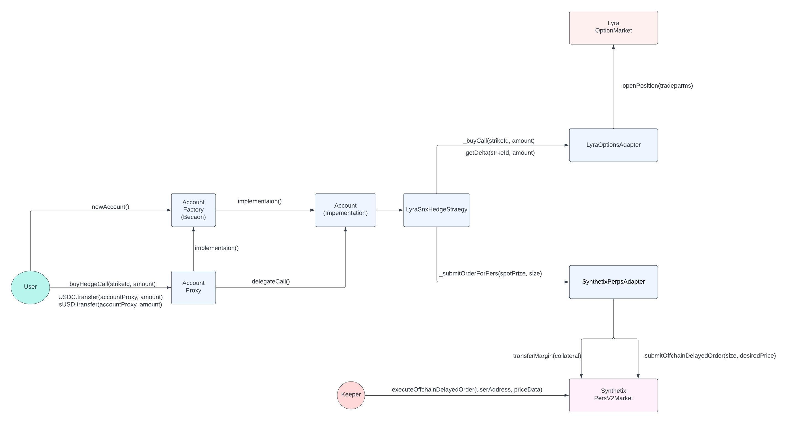

### Lyra Hedge Call Demo

#### Installation
```bash
$ yarn
$ curl -L https://foundry.paradigm.xyz | bash
$ foundryup
$ git submodule update --init --recursive
```

#### Testing
```bash
$ FOUNDRY_PROFILE="fork" forge test -vvv --fork-url <OPTIMISM_RPC_URL>
```
**Note**: *replace `<OPTIMISM_RPC_URL>` with an actual node url for Optimism mainnet.*

*Some notes on testing*
- Foundry evm is not fully compliant with optimism's EVM. `vm.rollFork` doesn't sync block changes after calling it more than once inside the test function.
   However, `vm.rollFork` works fine inside the `setUp` function.
   Because of this, each test had to moved to a separate Test contract. This way every test can have its own `setUp` function.
- The fork tests roll to blocks that have already been finalised. Positions that the tests open get overriden by a new owner when the test rolls to a new block.
  For this reason, the tests re-open new positions to mock options that were opened at a previous block.

#### Architecture



*Account Architecture* 
- The account contract is designed to be upgradeable using the beacon proxy pattern.
- A user creates a new account by calling the `newAccount()` function on the `AccountFactory` contract and returns the address of an `AccountProxy` instance.
- Whenever the User makes a call to the `AccountProxy` contract, the `AccountProxy` requests the `AccountFactory` contract for the implementation contract address and then delegates the call further to the implementation contract via `DELEGATECALL`.
- The Account Contract inherits from the `LyraSNXHedgeStrategy` contract that has the core logic for the `buyHedgeCall` function.
- The Account also has methods to withdraw ERC20 tokens.

*LyraSNXHedgeStrategy Architecture*
- The `LyraSNXHedgeStrategy` contract inherits from `LyraOptionsAdapter` and `SynthetixPerpsAdapter`
- The `LyraOptionsAdapter` contract has the logic for buying a long call option from lyra and to calculate the delta of any given strike.
- The `SynthetixPerpsAdapter` contract has the logic for transferring margin and submit orders for buying/selling perps on synthethix perps v2.
- `LyraSNXHedgeStrategy` also contains a function that allows users to re hedge their positions. 
- `SynthetixPerpsAdapter` submits offchain delayed orders. A keeper/user needs to execute this orders.

#### Example

TODO

#### Design consideration and Limitations

TODO
